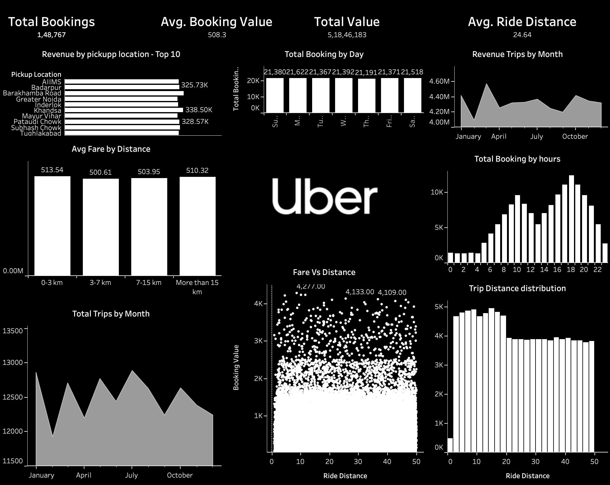

# 🚖 Uber Ride Analytics Dashboard

An interactive Tableau dashboard built to analyze Uber ride bookings, revenue trends, trip distance patterns, and customer ride behavior using data visualization techniques.

---

## 📊 Dashboard Features

- Total Bookings Analysis
- Average Booking Value
- Average Ride Distance
- Revenue Trends by Month
- Total Bookings by Day & Hour
- Pickup Location Analysis
- Fare vs Distance Analysis
- Trip Distance Distribution
- Distance Bucket Categorization

---

## 🛠 Tools & Technologies Used

- Tableau
- Data Visualization
- CSV Dataset
- Dashboard Design
- Business Analytics

---

## 📈 Key Insights

- Peak booking hours occur during evening times.
- Certain pickup locations generate significantly higher revenue.
- Ride distances between 0–15 km dominate booking patterns.
- Monthly booking trends remain relatively stable throughout the year.
- Fare amount increases with ride distance but contains outliers.

---

## 📷 Dashboard Preview



---

## 📂 Project Structure

```bash
Uber-Ride-Analytics-Dashboard/
│
├── dashboard/
│   └── Uber_Dashboard.twbx
│
├── data/
│   └── uber_data.csv
│
├── images/
│   └── uber_dashboard.png
│
└── README.md
```

---

## 🚀 How to Use

1. Download the `.twbx` Tableau workbook
2. Open in Tableau Desktop or Tableau Public
3. Explore the interactive dashboard and filters

---

## 📌 Skills Demonstrated

- Data Cleaning
- Dashboard Development
- Interactive Visualization
- Business Intelligence
- Analytical Thinking
- KPI Reporting

---

Created by Nishtha Arora
